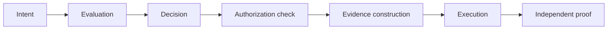

# Between Intent and Side Effect

**The Strix architecture for governing AI agent execution**

**Version 1.0.1 · Published 2026-08-27 · Maintained at this URL; corrections are recorded in the change history at the end, never silently edited.**

---

## What this document is

This is the durable, versioned statement of the Strix architecture: what Strix is, the execution sequence it enforces, the promises that sequence is built to keep, the boundaries of what Strix claims, and how to check the checkable parts yourself without trusting us.

The companion article on LinkedIn is the readable introduction. This document is the reference. When the two differ, this document governs, and the difference is a correction to record here.

---

## The category

Strix is a **runtime execution-control kernel** that sits between an AI agent's intent and the side effect that intent would cause.

"Kernel" here means a user-space execution-governance service — the one place governed actions must pass through before they take effect — not an operating-system kernel. Strix holds no special position in the OS; its position is architectural: governed routes are mediated by its boundary, and the boundary decides whether the side effect occurs.

The one-line division of labor:

> **Models decide. Agents orchestrate. Strix controls execution.**

What Strix is **not**:

- not an AI safety prompt
- not a model guardrail
- not an agent-management dashboard
- not a conventional permission system
- not a mutable audit trail
- not a complete enterprise AI-governance control plane
- not an operating-system kernel

Each of those solves a real problem. None of them decides, at the moment of execution, whether *this exact action* may cause *this exact side effect* — and produces proof of that decision a third party can check.

---

## The problem

An agent can hold a legitimate identity, present valid credentials, follow a reasonable plan, and act under an approval a human really granted — and still take an action that should not happen.

That is because these are different questions:

1. **Who is acting?** (identity)
2. **What are they generally allowed to do?** (permission)
3. **Should this exact action, with these exact parameters, against this exact target, execute right now?** (execution authorization)

Most of today's tooling answers the first two. The third question is the one that determines whether money moves, records change, or messages send — and it must be answered at execution time, every time, because context, budgets, and authority all change between the moment a plan was approved and the moment an action runs.

---

## The architectural sequence

Every governed action passes through seven stages, in order:



1. **Intent** — an agent (or a human) proposes a specific action with specific parameters.
2. **Evaluation** — deterministic policy evaluates that exact action, at that moment, in that context.
3. **Decision** — the evaluation yields an explicit decision record: allow, deny, or escalate to human approval.
4. **Authorization check** — before anything runs, the action must present bounded, single-use execution authority tied to the decision; approval of a *plan* is not authority to execute a *step*.
5. **Evidence construction** — a cryptographically signed record of what was authorized is constructed **before** the side effect, or the action is blocked.
6. **Execution** — the side effect occurs, only now.
7. **Independent proof** — the record is verifiable by anyone, using published open-source tooling, without trusting Strix's own UI or database.

The important point is not merely that all seven things exist. It is that **Strix preserves their order and separation**. Evaluation is not the same act as authorization. Authorization is not the same act as execution. Evidence is constructed in the execution path, not reconstructed after it. Proof is checked outside the system that produced it. Collapse any two of these into one step, and the guarantee that step was supposed to provide quietly disappears.

---

## Six architectural promises

These are the compact public form of the invariants the architecture enforces:

1. **Nothing governed executes before evaluation.** The boundary is on the execution path; a governed action that skips evaluation does not run.
2. **Authority is re-evaluated at the point of use — it is not inherited.** A prior approval, a parent agent's grant, or a role held yesterday does not carry forward on its own; each action earns its own answer.
3. **Approval binds to the exact action** — its scope, target, and payload. Change the payload after approval and the approval no longer applies.
4. **Execution authority is bounded, single-use, expiring, and revocable.** Authority to act once is not authority to act again.
5. **A governed high-consequence action produces evidence, or it is blocked.** Evidence is a precondition of the side effect, not a log written afterward if convenient.
6. **Proof is independently reproducible — and never stronger than the evidence.** A third party can re-derive the verification verdict with standard cryptography and published tools; and where evidence cannot support a claim, the surfaces say so rather than rounding up.

---

## Five contrasts

Where the emerging vocabulary sounds similar but the architecture differs:

| Familiar concept | In the Strix architecture |
|---|---|
| **Agent identity** | An *input* to evaluation — never itself permission to act |
| **Tool permission** | A capability plus its arguments, evaluated at execution time — not a standing grant |
| **Human approval** | Authority for the exact approved action — not reusable consent for a class of actions |
| **Audit logging** | Evidence bound into the governed boundary, tamper-evident and signed — not a mutable log beside it |
| **Vendor dashboard** | Proof is checkable independently, without trusting the vendor's own UI — the dashboard renders proof, it does not constitute it |

---

## The claim boundary

An architecture document is only trustworthy if it states what the architecture does *not* claim:

- **Strix governs the routes actually mediated by its boundary.** Route coverage is a distinct assurance claim, proven per effect-capable route — not an assumption that follows from the architecture existing.
- **A signed record proves the record and its signer.** It does not automatically prove an external system's resulting state; where Strix reports a provider outcome, it reports what it observed, and says so.
- **Multi-agent delegated execution has run and verified end to end in production** (July 2026), with delegated authority attenuating at every hand-off. It is not presented as a continuously operating production service.
- **Actor attestation covers the actor's class** — whether the acting principal was a registered agent or a human credential. Strix does **not** claim to detect an AI operating a human's own authenticated browser session.
- **Reference implementations are reference implementations.** Several governed capabilities exist as complete, tested reference code and are not presented as production services.

---

## Current operational status

Stated as of this document's publication date:

- Production governance evidence records have been publicly verifiable with a published npm verifier since **April 2026**; a live production record is re-verified in CI daily.
- The first production multi-agent governed run executed and verified — on the public proof surface and independently via the CLI — in **July 2026**.
- Agent actor-class attestation is live in production. Signed approval artifacts, offline proof bundles, and signed evidence records are in production use.
- Everything else should be read per the claim boundary above: real code, real tests, honest status, no production claim unless stated.

---

## Verify it yourself

None of this asks for trust. With Node.js installed:

```bash
# Verify a live production evidence record — cryptographic verification,
# open-source tooling, no Strix account:
npx @strixgov/verifier@latest 5686

# Verify the first production multi-agent run — the CLI re-derives the
# delegation-chain verdict from scratch and compares it to the server's:
npx @strixgov/verifier@latest swarm swarm_live_1783626787019_lpb1
```

Human-readable views of the same records:

- <https://verify.strixgov.com/r/5686> — the public receipt inspector. It
  fetches the JWKS and computes the verdict in your browser; it does not
  display a verdict served by Strix, and it shows the server's own claim
  separately so the two never blur.
- <https://www.strixgov.com/proof/swarm/swarm_live_1783626787019_lpb1>

The signed record itself is served as JSON at
<https://www.strixgov.com/api/public/proof/5686>.

Public artifacts:

- Verifier and open packages: <https://www.npmjs.com/package/@strixgov/verifier> (MIT), plus `@strixgov/sdk`, `@strixgov/governed-action`, `@strixgov/tool-gateway`, `@strixgov/mcp-proxy` on npm
- Public source: <https://github.com/Strixgov/strix>

---

## The thesis, and its record

Strix has been built around a specific architectural thesis: **agent governance becomes real only when it changes whether a side effect can occur and produces proof that can be checked outside the governing system.**

That thesis is not asserted from memory; it has a public record. The independent verifier was first published to npm on **2026-04-09** — anyone can confirm this with `npm view @strixgov/verifier time.created` — and the public commits, releases, demonstrations, and verification runs since then form a checkable timeline. We make no claim to have invented the ideas here; we claim to have built them in this order, with this separation, and to have published the means of checking that.

---

## Change history

| Version | Date | Change |
|---|---|---|
| 1.0 | 2026-08-27 | Initial publication. |
| 1.0.1 | 2026-08-27 | Corrected the human-readable link for record 5686. v1.0 linked `/proof/5686`, which is keyed by a record's evidence hash rather than its record id and returned "Invalid Evidence ID". Now links the public receipt inspector, which is keyed by record id and computes its verdict in the reader's browser. The verifier commands were unaffected and unchanged. |
